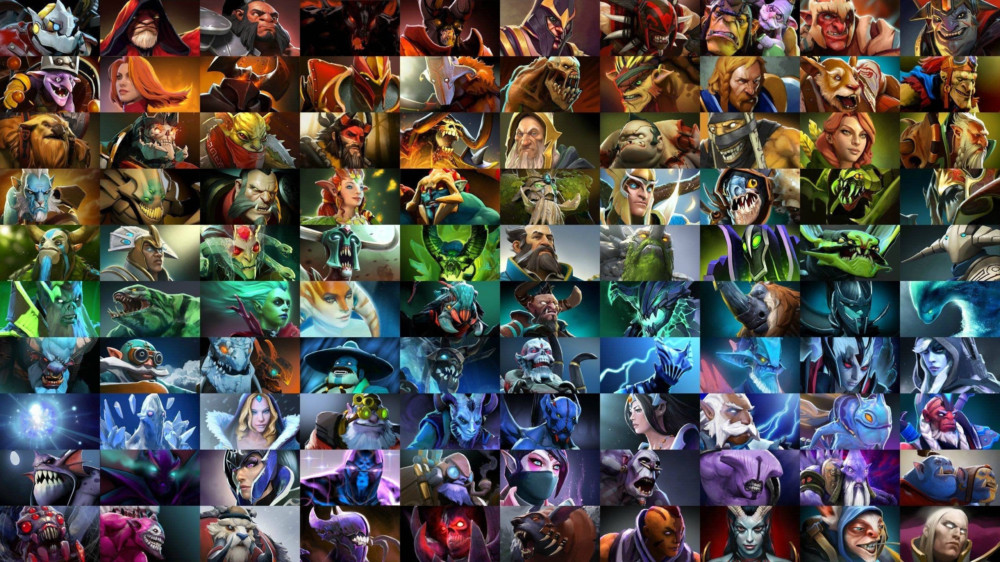

## Поставленная Задача

Мы хотим сделать так, чтобы чтобы у новых игроков было меньше когнитивных препятствий для начала игры и более плавный старт в игре. Это поможет нам привлечь и зантересовать больше начинающих игроков, а также уменьшить количество игроков которые начинают играть и бросают из-за сложности. Для этого нам нужно проанализировать и сделать следующее:

1. Разделить всех неанонимных игроков по **классам мастерства** (от 1 до 3), учитывая разные показатели, чтобы сбалансированно формировать команды;
2. Посчитать статистики по разным классам и посмотреть **каких героев предпочитают игроки в разных классах**, чтобы рекомендовать героев, в зависимости от уровня мастерства игрока.


## Решение

> task2.sql оформлен в виде чистого sql

Создадим базовый MATERIALIZED VIEW для первого пункта, отбросив анонимных игроков, включив статус активности и необходимые нам поля

```sql
CREATE MATERIALIZED VIEW base_view_f AS (
WITH cte AS (
  SELECT
    account_id,
    COUNT(DISTINCT match_id) AS matches,
    SUM(kills) AS total_kills,
    SUM(deaths) AS total_deaths
  FROM
    dota.players
  WHERE
    account_id > 0
  GROUP BY
    account_id
),
cte2 AS (
  SELECT
    *,
    CASE WHEN cte.matches > 1 THEN 'active' ELSE 'not_active' END AS active_status
  FROM
    cte
)
SELECT
    account_id,
    match_id,
    hero_id,
    h.localized_name AS hero_name,
    gold,
    gold_spent,
    gold_per_min,
    xp_per_min,
    kills,
    deaths,
    assists,
    denies,
    cte2.active_status as active_status
FROM
    dota.players p
    INNER JOIN dota.match m USING(match_id)
    INNER JOIN dota.hero_names h USING(hero_id)
    INNER JOIN cte2 USING(account_id)
WHERE
    account_id > 0
ORDER BY
    account_id
);
```

Проверим корректность

```sql
SELECT * FROM base_view_f;
```

Создадим MATERIALIZED VIEW аккаунтов и **самых популярных героев для каждого аккаунта**

```sql
CREATE MATERIALIZED VIEW accounts_hr_f AS (
WITH cte AS (
    SELECT
        account_id,
        hero_name,
        ROW_NUMBER() OVER (
            PARTITION BY hero_name
            ORDER BY hero_count DESC
        ) AS hero_place
    FROM
        (
            SELECT
                account_id,
                hero_name,
                COUNT(hero_name) AS hero_count
            FROM
                base_view_f
            GROUP BY
                account_id, hero_name
        ) query_in
)
SELECT
    account_id,
    hero_name
FROM
    cte
WHERE
    hero_place = 1
ORDER BY
    account_id
);
```

Проверим корректность

```sql
SELECT * FROM accounts_hr_f;
```

Создадим MATERIALIZED VIEW аккаунтов и выведем **показатель отношения количества убийств** к количеству смертей за всё время для каждого аккаунта, и разделим всех игроков по этому показателю на 3 категории, отсеив неактивных игроков

```sql
CREATE MATERIALIZED VIEW accounts_kd_ratio_f AS (
WITH cte AS (
SELECT
    account_id,
    CASE WHEN total_deaths > 0 THEN total_kills / total_deaths ELSE total_kills END AS kills_deaths_ratio
FROM
    (
        SELECT
            account_id,
            SUM(kills) AS total_kills,
            SUM(deaths) AS total_deaths
        FROM
            base_view_f
        GROUP BY
            account_id
    ) query_in
ORDER BY
    kills_deaths_ratio DESC
)
SELECT
    account_id,
    kills_deaths_ratio,
    ntile(3) OVER (ORDER BY kills_deaths_ratio DESC) AS group_number
FROM
    cte
    INNER JOIN base_view_f USING(account_id)
WHERE
    active_status = 'active'
);
```

Проверим корректность

```sql
SELECT * FROM accounts_kd_ratio_f;
```

Посмотрим на средее ratio для разных классов мастерства игроков

```sql
SELECT
    group_number,
    AVG(kills_deaths_ratio)
FROM
    accounts_kd_ratio_f
GROUP BY
    group_number
ORDER BY
    group_number;
```


### ОСНОВНОЙ ЗАПРОС

Наконец узнаем, каких героев предпочитают игроки, хорошо играющие и не очень

```sql
SELECT
    group_number,
    hero_name,
    COUNT(hero_name) AS hero_count,
    AVG(kills_deaths_ratio) AS kills_deaths_ratio
FROM
    accounts_hr_f
    INNER JOIN accounts_kd_ratio_f USING(account_id)
GROUP BY
    group_number, hero_name
ORDER BY
    group_number, hero_count DESC;
```

### Выводы

В итоге мы смогли **разделить всех активных игроков на 3 группы** (group_number) по вычисленному отношению убийств к смертям для каждого аккаунта за всё время игры.

Также составили таблицу **популярности персонажей** в для каждого выделенного нами класса и указали наш kills_deaths_ratio для каждого класса. Видно, что у "мастеров" присутствуют герои с достаточно высоким показателем ratio (Phantom Assasin, Invoker, Clinkz, Outworld Devourer), коих не наблюдается у менее скилловых игроков.

При этом нет чёткой зависимости популярности персонажа от данной метрики, что объясняется тем, что это больше командная игра.

> Также интересное наблюдение, что **"средние" игроки пользуются в 2 раза меньше** уникальными персонажами в отличии от двух других классов (запрос ниже).

```sql
SELECT
    group_number,
    COUNT(DISTINCT hero_name)
FROM (
    SELECT
        group_number,
        hero_name,
        COUNT(hero_name) AS hero_count,
        AVG(kills_deaths_ratio) AS kills_deaths_ratio
    FROM
        accounts_hr_f
        INNER JOIN accounts_kd_ratio_f USING(account_id)
    GROUP BY
        group_number, hero_name
    ORDER BY
        group_number, hero_count DESC
    ) query_in
GROUP BY
    group_number;
```
